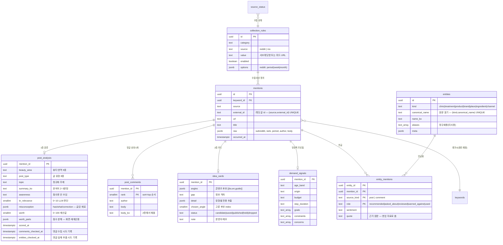

# ERD — 데이터 모델

작성 2026-08-26 · Postgres

---

## 설계 원칙

1. **원본과 해석을 분리한다.** `mentions`는 수집한 그대로. 분석 결과는 별도 테이블에 쌓아서, 재분석해도 원본이 망가지지 않는다.
2. **주마다 소비되는 것과 누적되는 것을 나눈다.** 콘텐츠 소재(`idea_cards`)는 주 단위로 소비되고, 실체(`entities`)는 영원히 누적된다.
3. **재실행이 안전하다.** 모든 파이프라인이 "아직 처리 안 한 것"만 골라 처리한다 → 크론이 두 번 돌아도 API가 재과금되지 않는다.
4. **"안 했다"와 "해봤는데 결과가 없었다"를 구분한다.** 이걸 안 하면 무한 루프가 난다 (아래 참고).

### `*_checked_at` 컬럼이 왜 필요한가

`post_analysis`의 `comments_checked_at` · `entities_checked_at`은 **"시도했음"을 남기는 도장**이다.

결과 행이 생겼는지로 판단하면 안 된다.
- 댓글이 0개인 글 → `post_comments`에 행이 안 생김 → 영원히 "댓글 안 가져옴"
- 댓글에 이름이 없는 글 → `entity_mentions`에 행이 안 생김 → 영원히 "실체 추출 안 함"

**실제로 이 두 가지가 각각 무한 루프를 냈다.** (실측: 실체 추출이 한 tick에서 60번 반복,
매번 LLM이 돌아 약 100원 낭비)

결과가 0건이어도 도장을 찍어서 **"해봤고 없었다"로 확정하고 버린다.**

---

## 관계도



---

## 테이블별 역할

### 수집 축

| 테이블 | 역할 | 핵심 제약 |
|---|---|---|
| `collection_rules` | 무엇을 수집할지 (서브레딧·피드 목록) | `(category, source, value)` UNIQUE |
| `mentions` | 수집한 글 원본. **절대 수정하지 않는다** | `(source, external_id)` UNIQUE → 중복 수집 방어 |
| `post_comments` | 글당 상위 5개 댓글 | `(mention_id, rank)` PK |
| `source_status` | 수집 성공·실패 이력 | `(source, category)` PK |
| `title_excludes` | 정기 게시판 제목 제외어 (11건) | 수집 시점에 적용 |

### 해석 축 — 매주 갱신

| 테이블 | 역할 |
|---|---|
| `post_analysis` | 1층 분류 결과. `comments_checked_at`이 댓글 재수집 방지 열쇠 |
| `idea_cards` | 2층 카드 + 운영자의 확정·메모 |
| `demand_signals` | 한국 방문·구매 의사가 드러난 글의 프로필 |

### 누적 축 — 사라지지 않는다

| 테이블 | 역할 |
|---|---|
| `entities` | 병원·시술·제품·브랜드·성분·장소·구매처 |
| `entity_mentions` | 어느 글/댓글에서 어떤 맥락으로 언급됐나 + **원문 인용** |

`entity_mentions`의 PK에 `role`과 `source_kind`가 들어간 이유:
같은 병원이 **본문에선 문의(asked_about), 댓글에선 추천(recommended)**으로 나올 수 있고, 그 둘을 따로 세야 한다.

---

## 누적 자산이 만들어내는 것

`entity_mentions`만 집계하면 LLM 없이 SQL로 나오는 것들:

```sql
-- 궁금해하는데 아무도 답 안 한 키워드 (= 선점 기회)
select e.canonical_name, count(*) filter (where em.role='asked_about') as 궁금
from entities e join entity_mentions em on em.entity_id = e.id
group by 1
having count(*) filter (where em.role='asked_about') > 0
   and count(*) filter (where em.role in ('reviewed','recommended')) = 0;

-- 영어권에서 실제로 추천되는 병원 랭킹 (= 광고 영업 리스트)
select coalesce(e.name_ko, e.canonical_name) as 병원, count(*) as 추천횟수,
       array_agg(em.quote) as 근거
from entities e join entity_mentions em on em.entity_id = e.id
where e.kind = 'clinic' and em.role = 'recommended'
group by 1 order by 추천횟수 desc;
```

**엔티티 추출 비용은 1층에서 이미 지불됐다.** 이 조합들은 전부 공짜다.

---

## 레거시 · 정리 대상

| 테이블 | 상태 |
|---|---|
| `keywords` (467건) | 기존 프로젝트에서 이월. `ingest.ts`가 **글 제목을 그대로** 넣는 중(평균 60자). 실질 역할은 `post_analysis.topic`이 대신하므로 정리 필요 |
| `instagram_*` (4개) | 인스타그램 코드는 삭제했지만 테이블은 보존(비파괴). 이 프로젝트에서 안 씀 |
| `keyword_daily` `keyword_scores` `ideas` `channel_outputs` 등 | 기존 스키마에 있으나 미사용 |
| `clients` `surveys` `tasks` `submissions` | **다른 프로젝트가 같은 DB를 공유 중.** 건드리지 말 것 |

---

## 미구현

- **`entities.aliases` 미사용.** `Seoul Sy`와 `서울에스와이피부과의원`이 별도 행으로 저장돼 있다. 같은 병원을 하나로 묶는 규칙이 필요
- ~~`idea_cards.status` 미연동~~ ✅ 해결. `/board`가 Server Action으로 직접 쓴다
