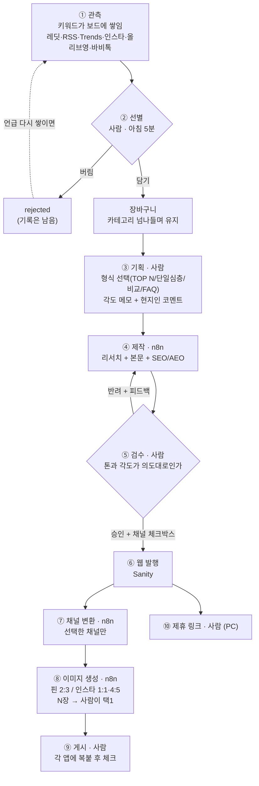
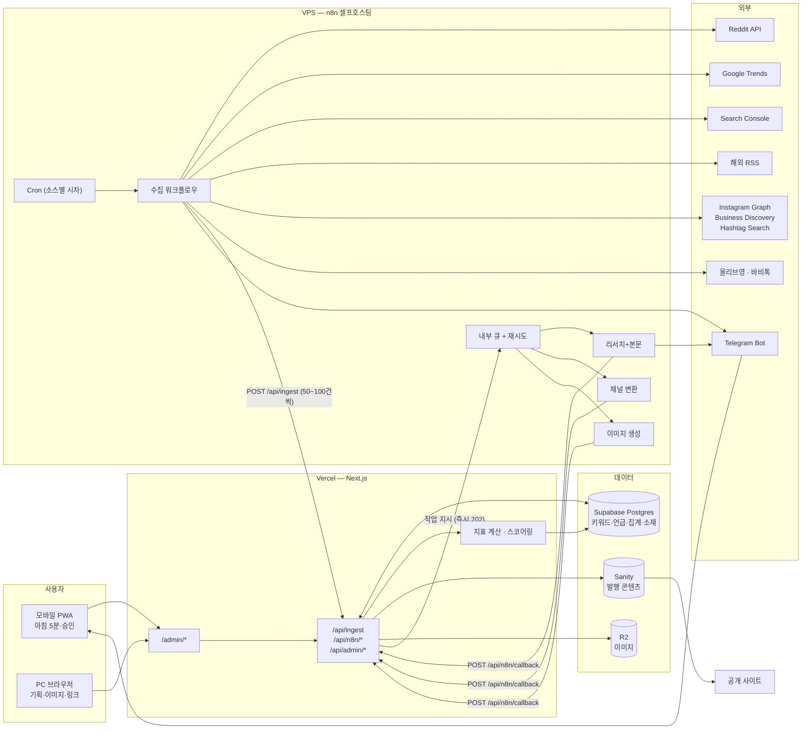

# Muse of Seoul 운영 대시보드 — 통합 설계서

- **작성일**: 2026-08-21
- **근거**: 실사용자(경민) 인터뷰 4차 · 총 20라운드 + 기존 코드베이스 실측 + 외부 API 실현가능성 조사
- **범위**: 운영자 대시보드(`/admin/*`)와 그 API·배치. **공개 홈페이지는 수정하지 않는다.**
- **대체 관계**: 이 문서가 `03-dashboard-problem-definition.md`·`04-dashboard-build-spec.md`를 흡수한다. 충돌 시 이 문서가 우선.

---

## 0. 한 줄 정의

> **한국인 뷰티 크리에이터가 "지금 판이 어떤지"를 매일 아침 5분에 파악하고, 고른 소재를 6개 채널로 끊김 없이 내보내도록 관리하는 키워드 관측 보드.**

이 대시보드의 본질은 **정보를 잘 찾아와서 보여주는 것**이다. 무엇을 어떻게 엮을지의 편집 판단은 사람이 갖고, AI는 다듬어진 소재를 받아 쓴다. 수익 집계는 두 번째 층이고 1차 범위 밖이다.

### 0.1 설계 과정에서 뒤집힌 두 가지

문서를 읽을 때 이 두 전환을 먼저 알아야 나머지가 이해된다.

**① 소재 큐 → 키워드 관측 보드.** 초기 설계는 "소재 카드를 스와이프로 처리하고 비우는 큐"였다. 그러나 실제로 필요한 것은 *누적 언급 횟수*, *창구별 콘텐츠화 현황*, *안 고른 것도 잊지 않게 다시 떠오르는 구조*였다. 이는 한 번 수집하고 끝나는 값이 아니라 **시간에 걸쳐 쌓이는 시계열**이다. 따라서 중심 개체는 소재가 아니라 **키워드**이고, 소스별 언급이 그 아래 쌓인다.

**② 파이프라인 자동화 → 관측 품질.** 초기 설계는 자동화 비중을 과하게 잡았다. 본문 작성은 이미 n8n으로 해결돼 있으므로, 대시보드가 감당해야 할 것은 **양 끝** — 수집·관측(위)과 확산·수익 연결(아래)이다.

---

## 1. 소재 1건의 생애주기

이 문서의 기준 순서도다. 키워드가 관측되기 시작해 6개 채널로 나가기까지의 전 과정.



### 1.1 사람이 손대는 지점과 예산

| # | 지점 | 기기 | 판단 내용 |
|---|---|---|---|
| 1 | 선별 (담기/버림) | 폰 | 이 소재를 쓸 가치가 있나 |
| 2 | 기획 (형식·각도·코멘트) | PC/폰 | 어떤 글이 될지 그려본다 |
| 3 | 검수 (승인/반려) | 폰 | 톤과 각도가 내 의도대로인가 |
| 4 | 이미지 택1 | PC | 브랜드 톤에 맞는가 |
| 5 | 제휴 링크 삽입 | PC | 어떤 상품을 연결할까 |
| 6 | 채널 게시 체크 | 폰 | 다 나갔나 |

```
소재 1건당 6회 × 주 5건 = 주 30회
```

> **설계 제약**: 이 30회를 넘기지 않는다. 채널마다 따로 승인을 받으면 주 45회 이상이 되고 아침 5분 루틴이 무너진다. **사람의 판단은 소재 단위로 한 번만 받고, 채널 산출물은 그 판단을 상속받는다.**
>
> 참고: 이미지를 "채널 텍스트 확정 후 별도 실행"으로 정하면서 5회 → 6회가 됐다. 채널 변환과 동시에 돌렸다면 5회로 유지됐으나, **문구에 맞는 이미지가 나온다는 이점**을 택한 결과다. 되돌릴 수 있는 결정이다(D31).

---

## 2. 업무 구분

파이프라인 단계가 아니라 **업무의 종류**로 나눈 것. 각 업무는 주기·도구·산출물·담당이 다르다.

| # | 업무 | 주기 | 담당 | 도구 | 산출물 |
|---|---|---|---|---|---|
| **①** | **관측** — 키워드를 계속 지켜봄 | 매일 (소스별 상이) | 자동 | n8n + 외부 API | 키워드별 지표 시계열 |
| **②** | **선별·기획** — 고르고 묶고 각도 잡음 | 매일 아침 | **사람** | 대시보드(폰) | 소재 + 형식 + 각도 메모 |
| **③** | **제작** — 리서치 + 본문 | 소재 발생 시 | 자동 | n8n | 웹 본문 + SEO 필드 |
| **④** | **검수·발행** — 승인 판단 | 소재 발생 시 | **사람** | 대시보드(폰) | Sanity 발행글 |
| **⑤** | **확산** — 채널 재가공 + 이미지 | 승인 직후 | 자동 + **사람 택1** | n8n + 대시보드 | 채널별 문구·이미지 |
| **⑥** | **수익 관리** — 링크·정산 | 주 1회 | 사람 | 대시보드 | 링크 대장 (**1차 제외**) |

### 2.1 대시보드가 다루지 않는 업무

- **협찬·브랜드 광고 관리** — 문의 수신 → 협상 → 일정 → 제작 → 정산으로 도는 별개 흐름. 현재 유입이 없어 **자리만 잡고 나중에**.
- **틱톡 영상 촬영·편집** — 대시보드는 후킹·대본·자막 텍스트까지만 산출한다.
- **제휴 프로그램 가입·승인 유지** — 업무 범위엔 들어오나 1차 구현 대상은 아니다.

---

## 3. 사용자 정의

### 3.1 사용자는 한 명이다

| 항목 | 내용 |
|---|---|
| 사용자 | 경민 — 기획·제작·발행·수익화를 전부 담당하는 1인 운영자 |
| 정체성 | **한국인 · 현지인 · 뷰티 크리에이터** — 이것이 콘텐츠의 차별점이자 지표 설계의 근거 |
| 타깃 독자 | **영어권(북미 중심)**. 네이버·티스토리만 국내 한국어 |
| 결정 권한 | 100% 본인. 승인 대기·협업·권한 분리 요구 **없음** |
| 기술 수준 | Next.js/Sanity/n8n을 직접 다룸. 단 대시보드는 코드를 고치지 않고 운영 가능해야 함 |

> **설계 함의**: 멀티유저·권한·코멘트·승인 워크플로우는 전부 과잉이다. 대신 **혼자서도 잊지 않게 하는 장치**(재부상, 경고, 체크리스트, 상태 표시)가 핵심 기능이 된다.

### 3.2 사용 맥락 — 폰이 1급 시민

| 맥락 | 기기 | 하는 일 |
|---|---|---|
| 매일 아침 5분 체크 | **폰** | 밤새 쌓인 키워드 훑기 → 담기 → 초안 승인 |
| 이동 중 알림 받고 | **폰** | 텔레그램 푸시 → 링크 탭 → 즉시 승인/반려 |
| 글 작업 전후 | PC | 기획, 이미지 택1, 제휴 링크, 최종 검수 |

모바일은 "반응형으로 되면 좋고"가 아니라 **주 사용 경로**다. 기존 `/admin` PWA(홈화면 추가가 이미 동작)를 확장한다.

### 3.3 수익 채널

해외 어필리에이트(아마존·올리브영 글로벌·StyleKorean·YesStyle 등) · 여행 어필리에이트(Klook·Agoda) · 국내 어필리에이트(쿠팡파트너스) · 구글 애드센스 · 틱톡샵 · 협찬/브랜드 광고(향후)

---

## 4. 병목 분석

### 4.1 As-Is

```
[수집]          [선별]        [작성]       [발행]       [수익화]
키워드툴    →   머릿속    →   n8n      →  Sanity  →   제휴 링크
해외매체        판단         (자동,       업로드       수동 삽입
레딧/SNS                    SEO/AEO)                  + 기억
  ↑             ↑             ↑           ↑             ↑
흩어짐       기록 없음      해결됨     임시저장      추적 없음
                                     localStorage
```

### 4.2 병목 목록

| # | 병목 | 증상 | 영향 |
|---|---|---|---|
| **B1** | 수집처가 흩어져 있음 | 키워드툴·해외매체·레딧·인스타를 매번 따로 순회 | 소재 탐색에 시간 최다 소모. 재고가 없으면 그날 제작이 멈춤 |
| **B2** | 선별 기준이 머릿속에만 있음 | 수익 가능성·경쟁 강도·북미 화제성을 매번 즉흥 판단 | 판단 피로, 결정이 재현되지 않음 |
| **B3** | 진행 상태가 안 남음 | localStorage와 기억에 흩어짐 | 아침 5분 체크가 불가능한 근본 원인 |
| **B4** | 발행글–수익 링크가 기억 의존 | 어느 글에 어떤 링크가 붙었는지 기록 없음 | 링크 없는 글 방치 = 트래픽이 수익으로 안 이어짐 |
| **B5** | 멀티채널 확산 경로 없음 | 6채널로 뿌리려 하나 도구도 기록도 없음 | 주 5소재 × 6채널 = **주 30개 산출물**, 수동으로는 붕괴 |
| **B6** | 좋은 소재를 잊어버림 | 안 고른 것이 어디에도 안 남아 영영 사라짐 | 감으로 발굴한 자산이 휘발됨 |

### 4.3 무게중심

```
[수집·관측]  ██████████  ← 병목 (B1, B2, B6)
[작성]       ░░          ← 해결됨 (n8n)
[확산·수익]  ██████████  ← 병목 (B3, B4, B5)
```

> 대시보드가 손대야 할 곳은 가운데가 아니라 **양쪽 끝**이다.

---

## 5. 수동 / 자동 경계

### 5.1 대원칙 — 원장과 실행기의 분리

> **상태(state)는 대시보드가 소유하고, 실행(execution)은 n8n에 위임한다.**

- 대시보드 = **원장**. 어떤 키워드가 어떤 상태인지에 대한 유일한 진실
- n8n = **실행기**. 시키면 결과를 돌려주는, 교체 가능한 부품

근거: ①프롬프트를 코드 배포 없이 수정 ②실패한 갈래만 재실행 ③n8n을 걷어내도 데이터와 대시보드는 남음(락인 없음)

### 5.2 단계별 경계표

| 단계 | 처리 | 담당 | 모바일 |
|---|---|---|---|
| 키워드 수집 | 자동 | n8n cron → 앱 | — |
| 지표 계산·스코어링 | 자동 | **앱** | — |
| 인스타 피드 수집 | 자동 | n8n (Business Discovery) | — |
| 인스타 게시물 → 키워드 추출 | 자동(제안) | n8n LLM | — |
| **키워드 승격 (관측 대상 편입)** | **수동** 🔒 | 사람 | ✅ |
| **선별 (담기/버림)** | **수동** 🔒 | 사람 | ✅ |
| **소재 묶기 · 형식 · 각도 메모** | **수동** 🔒 | 사람 | ✅ |
| 리서치 + 본문 작성 | 자동 | n8n | — |
| **초안 검수 · 승인/반려** | **수동** 🔒 | 사람 | ✅ |
| 초안 텍스트 간단 수정 | 수동 | 사람 | ✅ |
| 채널 변환 (선택한 채널만) | 자동 | n8n | — |
| 이미지 생성 | 자동 | n8n | — |
| **이미지 택1 · 브랜드 톤 검수** | **수동** 🔒 | 사람 | ❌ PC |
| **제휴 링크 선택·삽입** | 반자동 🔒 | 사람이 결정 | ❌ PC |
| 채널 게시 체크 | 수동 | 사람 | ✅ |
| 알림 발송 | 자동 | n8n → 텔레그램 | — |

🔒 = 사용자가 명시적으로 "사람이 판단해야 한다"고 지정한 지점

### 5.3 알림 (텔레그램)

| 시점 | 내용 |
|---|---|
| 매일 배치 완료 후 | 소스별 수집 건수 요약 + 딥링크 |
| 초안 생성 완료 | "초안 도착" + 검수 화면 딥링크 |
| **소스 실패 즉시** | "구글 트렌드 3일째 누락 — 관심도·격차 지표가 낡았음" |
| 인스타 토큰 만료 7일 전 | 갱신 안내 |
| 수집 부족 | 목표 미달 + 어느 소스가 막혔는지 |

> 모든 알림에 **다음 액션 링크**를 붙인다. 읽고 끝나는 알림은 만들지 않는다.

---

## 6. 수집 정의

### 6.1 카테고리 4개를 따로 다룬다

`K-Beauty Products` · `K-Beauty Treatments` · `Stay in Seoul` · `Where to Go in Seoul`

수집처·지표·수익 구조가 서로 다르므로 **한 덩어리로 다루면 여행 소재에 뷰티 기준이 적용되는 왜곡**이 생긴다. 카테고리를 최상위 축으로 둔 이유다.

### 6.2 카테고리별 수집처

#### ① K-Beauty Products (메인)

| 소스 | 무엇을 어떻게 | 자동화 | 비용 |
|---|---|---|---|
| Reddit API | ①지정 키워드 검색(`k beauty`, `skincare`, `korea skin product`, `glow skin tips` 등) ②주간 top ③지정 소재의 rising/hot | 완전자동 | 무료 |
| 해외 매체 RSS | 기사에서 **LLM이 제품명을 추출**해 소재화 (제목 그대로 쓰지 않음) | 완전자동 | 무료 |
| Google Trends | KR·US 지역 분리 조회 | 완전자동 | 무료(비공식) |
| Search Console | 내 사이트가 이미 노출되는 쿼리 | 완전자동 | 무료 |
| 올리브영 랭킹 | 순위와 순위 변동 → **국내 선행 반응** | 자동(파싱) | 무료 |

#### ② K-Beauty Treatments

| 소스 | 무엇을 어떻게 | 자동화 | 근거 |
|---|---|---|---|
| **바비톡** | 시술명 언급·후기 수 | **자동** | robots.txt가 일반 크롤링 허용(`/login`·`/mypage`만 차단). **저빈도 + 원문 링크 표기 조건** |
| 강남언니 | — | **1차 제외** | 봇 차단(403). 자동 수집 불가 |
| 인스타 뷰티 계정 | 핫한 시술명·업체 | 자동(계정 모니터링) | Business Discovery |
| 본인 시술 후기 | 직접 입력 | 수동 | 차별화의 핵심 자산 |
| Reddit | 시술 후기·여행 커뮤니티의 "서울에서 받을 만한 시술" 질문 | 자동 | 무료 |

> 이 카테고리는 **제휴 링크가 거의 없다.** 광고·협찬 수익 중심이며, **시술 → 인근 숙소(Agoda·Klook)로 넘기는 구조**가 수익원이 된다. 외국인 독자에게는 **가격·예약방법·영어 응대 여부**가 핵심 정보다.

#### ③ Stay in Seoul

**제휴 상품에서 역기획한다.** 어필리에이트 수익이 목적이므로 정공법이다.

선별 기준: **해외 검색에서 이미 찾는 곳** · **시술 밀집지역(강남·청담) 근접성**
보조: Klook·Agoda 인기상품/프로모션, 레딧 여행 서브, 구글 Trends 여행 키워드
제외: 여행 매체 RSS — 서울 관련 기사 빈도가 낮아 투입 대비 산출이 나쁨

#### ④ Where to Go in Seoul

**국내 인스타 정보 계정이 씨앗이다.** 30개 이상 계정을 모니터링해 장소·행사를 발견하고, 이를 **네이버·구글·AI로 사실 보강한 뒤 영어권용으로 재가공**한다.

선별 기준: **해외에 아직 안 알려졌는가** · **사진이 잘 나오는가**(핀·인스타용) · **시기성·행사 여부**
보강: 한국관광공사 TourAPI(공공데이터·무료·합법), 카카오맵/네이버 지역 API

### 6.3 인스타그램 — 두 갈래

인스타는 **계정 모니터링**과 **떠오르는 키워드**로 나뉘며, 쓰는 API가 다르다.

#### (A) 계정 모니터링 — Business Discovery API

| 항목 | 내용 |
|---|---|
| 무엇 | 모아둔 30개 이상 계정의 최근 게시물(캡션·썸네일·게시일·참여지표) |
| 조회 방식 | **아이디로만.** 키워드 검색은 불가 |
| 조건 | 내 계정과 대상 계정 **양쪽 다 프로페셔널(Business/Creator)**. 개인 계정은 조회 불가 |
| 비용 | 무료. 30계정 × 하루 1회 = 월 약 900콜 (한도 시간당 약 240콜 대비 여유) |
| 안 되는 것 | 팔로워 목록, 개인 계정, 자유 키워드 검색 |

> 같은 일을 Apify로 하면 결과 건수만큼 과금된다. **계정 모니터링은 공식 API가 압도적으로 유리하다.**

#### (B) 떠오르는 키워드 — Hashtag Search API

| 제약 | 활용법 |
|---|---|
| 7일 롤링 기준 **고유 해시태그 30개** 한도 | 카테고리별 7~8개씩 **총 30개를 고정** |
| **같은 해시태그 재조회는 쿼터를 소모하지 않음** | 고정한 30개를 **매일 조회** — 쿼터는 안 늘고 결과만 쌓임 |
| 결과가 최근 24시간치뿐 | 매일 쌓아 **시계열을 만드는 구조와 오히려 맞음** |

**떠오르는 키워드 산출 방식**
```
매일 고정 해시태그 30개 조회
  → top_media / recent_media 수집
  → 캡션·동시 출현 해시태그의 단어 빈도를 날짜별 집계
  → 전주 대비 급등한 단어 = "지금 인스타에서 떠오르는 키워드"
```

해시태그 30개는 **AI가 제안하고 사용자가 확정**한다. 7일 쿼터를 쓰므로 자주 바꾸면 손해다.

#### (C) Apify — 보조

자유 키워드 검색이 꼭 필요하거나 프로페셔널이 아닌 개인 계정을 봐야 할 때만. 저가 액터가 1000건당 $0.3 수준으로 비용 자체는 작으나, 약관 리스크와 깨질 위험이 있어 주력으로 두지 않는다. **구체적 용도는 추후 결정.**

### 6.4 수집 결과 처리 규칙

- **중복 병합** — 같은 제품이 레딧·RSS·Trends에 동시 등장하면 **하나로 병합하고 가점**한다. 여러 소스 동시 등장은 진짜 화제라는 강한 신호다.
- **소재 단위** — 제품/장소 **1개 = 소재 1건**. 여러 소재를 묶어 글 1개를 만든다.
- **키워드 승격** — 인스타 등에서 AI가 추출한 키워드는 **사람이 눌러야** 관측 대상이 된다. 자동 승격하면 보드가 금방 지저분해진다.
- **오래된 소재를 죽이지 않음** — 삭제·자동 보류 없음. 대신 **신선 재고(14일 이내)** 기준으로 세고 보여준다(§11.2).

---

## 7. 관측 지표 정의

**이 절이 이 대시보드의 제품이다.** 무엇을 어떤 숫자로 보는지가 화면·스코어링·저장 스키마를 전부 결정한다.

### 7.1 소스별로 실제 뽑을 수 있는 것

| 소스 | 취득 가능 지표 | 성격 |
|---|---|---|
| Reddit API | 언급 게시물 수, 추천수 합, 댓글수, 최초·최근 언급일 | 절대값, 신뢰도 높음 |
| Google Trends | 관심도 지수 0–100, **지역 분리(KR / US)** | **상대값**. 절대 검색량이 아님 |
| Search Console | 내 사이트의 노출수·클릭·순위 | 내 실적. 시장 수요 아님 |
| 해외 매체 RSS | 키워드를 다룬 기사 수·매체·날짜 | 절대값 |
| 올리브영 랭킹 | 순위·순위 변동 | 국내 선행 신호 |
| 바비톡 | 시술명 언급·후기 수 | 국내 선행 신호 |
| 인스타 | 게시 빈도 **추세(늘고/줄고)** | 불안정, 참고용 |

### 7.2 공통 지표 (전 카테고리)

| 지표 | 계산 | 읽는 법 |
|---|---|---|
| **언급량** | 레딧 게시물·추천·댓글 + RSS 기사 수 (7일 / 30일 누적) | 절대 화제성 |
| **관심도** | Trends 지수를 **KR·US 따로** | 지역별 수요 |
| **격차** | `KR − US` | **양방향으로 읽는다** ↓ |
| **급등률** | 최근 7일 ÷ 직전 7일 | 지금이 타이밍인가 |
| **경쟁 강도** | 영문 검색 상위 10개 중 **대형매체 비율** | 낮을수록 빈틈 |
| **수익 연결 가능성** | 제휴처(아마존·올리브영·StyleKorean·Klook) **검색으로 자동 확인** | 링크를 붙일 수 있나 |
| **관측 이력** | 최초 언급일, 관측 일수 | 묵은 것 / 새 것 |

### 7.3 격차 지표 — 양방향으로 읽는다

이 사업의 핵심 지표다. 한국인이 영어권에 정보를 전달한다는 정체성이 여기서 숫자가 된다.

| 격차 | 뜻 | 행동 |
|---|---|---|
| **KR ≫ US** | 「국내 선행」 — 한국에선 떴는데 영어권엔 아직 없음 | **내가 먼저 전달할 빈자리.** 선점 기회 |
| **US ≫ KR** | 「해외 선행」 — 영어권에선 떴는데 국내에 소식이 안 돎 | **놓치면 안 되는 것.** 레딧·구글·해외 RSS를 받는 이유가 이것 |
| 비슷함 | 동시 진행 | 경쟁 강도로 판단 |

> 한 방향만 보면 절반을 놓친다. 보드는 **격차의 크기와 방향을 함께** 표시한다.

### 7.4 카테고리 전용 지표

| 카테고리 | 추가 지표 |
|---|---|
| K-Beauty Products | 올리브영 랭킹·순위 변동, 제휴처 판매 여부 |
| K-Beauty Treatments | 바비톡 후기 수·증가율, **내 경험 보유 여부** |
| Stay in Seoul | 제휴 수수료율, 강남·청담 거리, 해외 검색 수요(Trends US) |
| Where to Go | 행사 종료일(시기성), 사진 적합도(수동 플래그), 접근성(영어 가능·예약 필요) |

### 7.5 소스별 관측 주기

| 소스 | 주기 | 근거 |
|---|---|---|
| Reddit | 매일 | 변동이 빠르고 API가 무료 |
| 해외 RSS | 매일 | 수집과 동시 |
| 인스타 계정 + 해시태그 | 매일 | 해시태그 결과가 24시간치뿐 |
| Google Trends | **주 2회** | 지수라 일간 노이즈가 크고, 비공식 경로라 호출을 아껴야 함 |
| 올리브영 랭킹 / 바비톡 | 주 1회 | 랭킹·후기 수는 천천히 변함 |
| 경쟁 강도(SERP) | 키워드당 최초 1회 + **월 1회** 갱신 | 호출이 비쌈 |

### 7.6 스코어링

**4축**: 화제성(언급량·급등) · 격차 · 경쟁 · 수익 연결 가능성

- **가중치 최우선 = 화제성.** 지금 실제로 사람들이 찾는 것이 트래픽과 가장 직결된다.
- 정렬은 **탭으로 전환 가능**하게 한다 — 종합 / 급등 / 격차.
- **소스가 죽었을 때는 살아있는 소스로만 재계산**한다. 낡은 값으로 순위를 매기면 정렬 자체가 거짓말이 된다(§17.3).
- 구체적 가중치 수치는 미확정 — §20에 등록.

---

## 8. 제작 · 확산 정의

### 8.1 글 형식 — 고정하지 않는다

소재 성격에 따라 다르므로 **소재를 묶을 때 사용자가 고른다.**

| 형식 | 언제 |
|---|---|
| **TOP N 모음글** | 소재를 여러 개 묶었을 때. 제휴 링크를 여러 개 붙일 수 있어 수익성이 높음 |
| **단일 심층 리뷰·가이드** | 소재 1개. 시술·숙소처럼 정보량이 많은 것 |
| 비교표 (A vs B) | 구매 직전 검색에 강함 |
| 정보성 FAQ형 | AEO(AI 검색 인용)에 유리 |

### 8.2 리서치는 본문 워크플로우가 통째로 한다

n8n 본문 워크플로우가 네이버·구글·AI 리서치를 포함해 사실을 채운다. 별도 보강 단계를 두지 않는다.

> **그래서 검수 화면이 중요해진다.** 자동으로 채워진 **주소·영업시간·가격·예약방법**이 틀린 채로 발행되면 신뢰가 깨진다. 검수 화면은 이 필드들을 눈에 띄게 배치한다.

### 8.3 채널 6개

| 채널 | 언어 | 산출물 |
|---|---|---|
| 웹 (Sanity) | 영어 | 본문 + SEO/AEO 필드 (**모든 글이 나감**) |
| Pinterest | 영어 | **이미지(2:3) + 제목 텍스트 + 설명** |
| Instagram | 영어 | **카드뉴스 슬라이드 문구 + 캡션 + 해시태그** |
| TikTok | 영어 | **후킹 + 대본 + 자막** (촬영·편집은 사람) |
| 네이버 블로그 | **한국어** | 번역이 아닌 **국내 독자용 재작성** |
| 티스토리 | **한국어** | 네이버와 같은 국내용 |

- **카테고리와 무관하다.** 소재별로 사용자가 원하는 채널만 고른다.
- **선택 시점**: 웹 발행 승인 화면에서 **체크박스**로. 승인 버튼 하나로 발행과 변환이 함께 돈다.
- **왜 승인 직후인가**: 반려된 원고에 변환 비용을 쓰지 않기 위해서다.

### 8.4 이미지

| 항목 | 결정 |
|---|---|
| 대상 채널 | **핀터레스트(2:3 세로) · 인스타(1:1 또는 4:5)** 만. 웹 대표 이미지는 기존 R2 수동 업로드 유지 |
| 원본 사진 | **상황에 따라 둘 다** — 가본 곳은 내 사진 기반 가공, 안 가본 곳은 AI 생성 |
| 프롬프트 | **기본은 자동 생성**(본문·제목 기반), 마음에 안 들면 사용자가 수정해 재생성 |
| 브랜드 톤 | **고정 템플릿에 이미지를 끼운다** — 플럼/모브/아쿠아 색과 Playfair 폰트가 박힌 틀. 톤이 항상 일정 |
| 제목 텍스트 오버레이 | **코드로 합성**(이미 쓰는 `sharp`). 생성 모델이 글자를 그리면 깨진다 |
| 선택 | **N장 생성 → 사람이 택1** |
| 실행 시점 | **채널 텍스트 확정 후 별도로** — 문구에 맞는 이미지가 나옴 |

### 8.5 반려 처리

```
review ──[반려 + 피드백 텍스트]──> drafting ──> review
                                     ↑
                    n8n 재생성 (피드백을 프롬프트에 주입)
```

- 반려는 **소재를 죽이지 않는다.** 원고만 새로 뽑는다.
- 피드백은 `revisions` 테이블에 이력으로 남긴다 — 같은 지적을 반복하지 않으려면 기록이 필요하다.
- **재생성 3회 초과 시 경고** — 소재나 프롬프트에 문제가 있다는 신호다.

---

## 9. 데이터 정의

### 9.1 화면마다 필요한 데이터가 다르다

판단의 종류가 다르면 필요한 데이터도 다르다. **같은 카드 컴포넌트를 재사용하면 안 된다.**

| | **선별 화면** | **검수 화면** |
|---|---|---|
| 대상 | 관측 키워드 (**글이 없음**) | 초안 원고 (**글이 있음**) |
| 질문 | "이 소재를 쓸 가치가 있나?" | "이 원고를 내보내도 되나?" |
| 근거 | 언급량·격차·경쟁·인기 지표 | 본문 품질·톤·SEO 필드 |
| 필요 데이터 | **지표 + 원자료** | **본문 + SEO + 각도 메모** |
| 점수 | 핵심 | **무의미** (이미 채택된 소재) |

#### (A) 관측 보드 `/admin/[category]`

| 필드 | 출처 | 표시 |
|---|---|---|
| `label` | 수집·추출 | 키워드명 |
| `summary` | 수집 시 1줄 요약 | 제목 아래 |
| 7일/30일 언급량 | 집계 | 숫자 + 스파크라인 |
| KR·US 관심도, **격차** | Trends | 「국내 선행」/「해외 선행」 배지 |
| 급등률 | 집계 | ↑/↓ 표시 |
| 경쟁 강도 | SERP 분석 | 대형매체 비율 |
| 수익 연결 | 제휴처 검색 | 있음/없음 |
| 출처 뱃지 | 언급 소스 | 레딧·RSS·인스타… |
| `age_days` | 계산 | "3일 전" 상대표시 |
| **데이터 신선도** | 소스 상태 | "3일 전 기준" 라벨(§17.3) |

#### (B) 인스타 피드 탭

30개 이상 계정의 새 게시물을 **전부 시간순**으로. 게시물마다 **썸네일 + 캡션 요약 + AI가 추출한 키워드**. 상단에 **떠오르는 키워드** 줄. 사용자가 누르면 키워드로 승격.

> 전부 펼치는 이유: AI 추출만 믿으면 놓친 것을 영영 못 본다. 계정 자체가 이미 사용자가 선별한 것이므로, 대시보드는 **정리해서 보여주기만** 하면 된다.

#### (C) 키워드 상세

**① 7일·30일 추이 그래프 → ② 이미 나온 경쟁 글 → ③ 창구별 언급 원문 목록 → ④ KR/US 관심도 비교**

#### (D) 소재 만들기

장바구니에 담긴 키워드들, **형식 선택**, **각도·관점 메모**, **내 경험·현지인 코멘트**, 예상 구성 미리보기.

#### (E) 검수

본문 전문(읽기+간단 수정), **각도 메모를 나란히**(의도 대조용), SEO 필드(메타·FAQ·스키마 타입), **자동 수집된 사실(주소·가격·예약)을 강조**, 원소재 링크, 재생성 횟수.

#### (F) 확산

채널별 문구 + **복사 버튼**, 이미지 후보 N장 중 택1, 6칸 게시 체크리스트, 웹 발행 URL.

#### (G) 상태 페이지

소스별 마지막 성공 시각·수집 건수·연속 실패 횟수, 인스타 토큰 잔여일, 배치 실행 이력.

### 9.2 스키마

```sql
-- ── 관측 축 ─────────────────────────────────────────
create table keywords (
  id            uuid primary key default gen_random_uuid(),
  label         text not null,
  summary       text,
  category      text not null check (category in ('products','treatments','stay','where-to-go')),
  status        text not null default 'observing'
                check (status in ('candidate','observing','archived')),
  first_seen_at timestamptz not null default now(),
  promoted_at   timestamptz,          -- 사람이 승격한 시점
  merged_into   uuid references keywords(id),  -- 병합된 경우 대표 키워드
  created_by    text default 'auto',  -- auto | manual
  updated_at    timestamptz not null default now()
);
create index on keywords (category, status);

-- 원본 언급 (1년 보관)
create table mentions (
  id            uuid primary key default gen_random_uuid(),
  keyword_id    uuid not null references keywords(id) on delete cascade,
  source        text not null check (source in ('reddit','rss','trends','gsc','instagram','oliveyoung','babitalk','klook','agoda','manual')),
  external_id   text not null,        -- 레딧 post id, 기사 URL 등
  url           text,
  title         text,
  raw           jsonb default '{}'::jsonb,   -- upvotes, comments, rank 등 원자료
  occurred_at   timestamptz not null,
  collected_at  timestamptz not null default now(),
  unique (source, external_id)        -- ★ 중복 실행 방어의 핵심
);
create index on mentions (keyword_id, occurred_at desc);

-- 일별 집계 (영구 보관)
create table keyword_daily (
  keyword_id       uuid not null references keywords(id) on delete cascade,
  day              date not null,
  reddit_posts     int  default 0,
  reddit_score     int  default 0,
  reddit_comments  int  default 0,
  rss_articles     int  default 0,
  trends_kr        smallint,
  trends_us        smallint,
  gap              smallint generated always as (coalesce(trends_kr,0) - coalesce(trends_us,0)) stored,
  ig_trend         text,              -- up | flat | down
  extra            jsonb default '{}'::jsonb,  -- 카테고리 전용 지표
  primary key (keyword_id, day)
);

-- 계산된 점수 (재계산 가능)
create table keyword_scores (
  keyword_id     uuid primary key references keywords(id) on delete cascade,
  buzz           smallint,   -- 화제성 (최우선 가중치)
  gap_score      smallint,   -- 격차 (절대값 기준)
  competition    smallint,   -- 낮을수록 좋음
  monetizable    smallint,   -- 제휴처 검색 결과
  total          smallint,
  sources_used   text[],     -- 계산에 쓰인 소스 (죽은 소스 제외)
  computed_at    timestamptz not null default now()
);

-- ── 제작 축 ─────────────────────────────────────────
create table ideas (                       -- 소재 = 키워드 묶음
  id             uuid primary key default gen_random_uuid(),
  title          text,
  category       text not null,
  format         text check (format in ('topn','deep','compare','faq')),
  angle_note     text,                     -- 각도·관점 메모
  local_comment  text,                     -- 현지인 코멘트
  status         text not null default 'selected'
                 check (status in ('selected','drafting','review','published','rejected')),
  channels       text[] default '{}',      -- 승인 시 선택한 채널
  sanity_post_id text,
  revision_count smallint not null default 0,
  selected_at    timestamptz not null default now(),
  published_at   timestamptz,
  updated_at     timestamptz not null default now()
);

create table idea_keywords (               -- 소재 ↔ 키워드 N:M
  idea_id    uuid not null references ideas(id) on delete cascade,
  keyword_id uuid not null references keywords(id) on delete cascade,
  rank       smallint,                     -- TOP N 순위
  primary key (idea_id, keyword_id)
);

create table channel_outputs (
  id           uuid primary key default gen_random_uuid(),
  idea_id      uuid not null references ideas(id) on delete cascade,
  channel      text not null check (channel in ('web','pinterest','instagram','tiktok','naver','tistory')),
  body         text,
  seo          jsonb default '{}'::jsonb,  -- web 전용: focus_keyphrase, meta_*, faq[], schema_org_type
  image_candidates jsonb default '[]'::jsonb,
  image_url    text,                       -- 사람이 택1한 결과
  status       text not null default 'pending'
               check (status in ('pending','generated','approved','posted','skipped','failed')),
  posted_at    timestamptz,
  updated_at   timestamptz not null default now(),
  unique (idea_id, channel)
);

create table revisions (
  id         uuid primary key default gen_random_uuid(),
  idea_id    uuid not null references ideas(id) on delete cascade,
  seq        smallint not null,
  feedback   text not null,
  created_at timestamptz not null default now(),
  unique (idea_id, seq)
);

create table affiliate_links (
  id             uuid primary key default gen_random_uuid(),
  idea_id        uuid references ideas(id) on delete set null,
  sanity_post_id text,
  program        text not null,
  product_name   text,
  url            text not null,
  added_at       timestamptz not null default now()
);

-- ── 운영 축 ─────────────────────────────────────────
create table source_status (
  source            text primary key,
  last_success_at   timestamptz,
  last_attempt_at   timestamptz,
  last_count        int,
  consecutive_fails smallint not null default 0,
  state             text not null default 'ok'
                    check (state in ('ok','degraded','down')),
  note              text
);

create table collection_rules (            -- 대시보드에서 편집 (키워드·소스 추가삭제)
  id        uuid primary key default gen_random_uuid(),
  category  text not null,
  source    text not null,
  value     text not null,                 -- 키워드 / 서브레딧 / RSS URL / 계정 ID / 해시태그
  enabled   boolean not null default true,
  created_at timestamptz not null default now(),
  unique (category, source, value)
);

create table jobs (
  id               uuid primary key default gen_random_uuid(),
  idea_id          uuid references ideas(id) on delete cascade,
  kind             text not null check (kind in ('write_body','convert_channels','generate_images')),
  channel          text,                   -- 채널 단위 재시도용
  status           text not null default 'queued'
                   check (status in ('queued','running','done','failed')),
  n8n_execution_id text,
  error            text,
  requested_at     timestamptz not null default now(),
  finished_at      timestamptz
);

create table title_excludes (              -- 대시보드에서 편집 (정기 게시판 등 제목 기반 제외 단어)
  id         uuid primary key default gen_random_uuid(),
  value      text not null unique,
  enabled    boolean not null default true,
  created_at timestamptz not null default now()
);
```

### 9.3 보관 정책

| 데이터 | 보관 | 이유 |
|---|---|---|
| `mentions` (원본) | **1년** | 계절성 비교에 작년치가 필요. 산식을 바꿔도 재계산 가능 |
| `keyword_daily` (집계) | **영구** | 가볍고, 장기 추이의 유일한 원료 |
| 전체 덤프 | **주 1회 별도 보관** | 관측 기록은 한번 잃으면 재생산이 불가능 |

---

## 10. 상태 정의

### 10.1 키워드 상태 (3개)

| 상태 | 뜻 | 진입 |
|---|---|---|
| `candidate` | AI가 추출했으나 아직 승격 전 | 인스타·RSS 추출 |
| `observing` | 관측 중 (**보드에 보임**) | **사람이 승격** |
| `archived` | 병합됐거나 사람이 지움 | 병합 / 수동 삭제 |

> 키워드는 **버려지지 않는다.** 소재로 안 쓴 키워드도 `observing`으로 남아 언급이 쌓이면 다시 위로 올라온다(B6 해소).

### 10.2 소재 상태 (5개)

```
selected ──> drafting ──> review ──> published
              ↑             │
              └──반려+피드백──┘
                            
    (어느 단계에서든) ──> rejected
```

| 상태 | 반드시 존재해야 할 데이터 |
|---|---|
| `selected` | format, 묶인 키워드 ≥1 |
| `drafting` | jobs(write_body) 행 |
| `review` | channel_outputs(web).body **+ seo** |
| `published` | sanity_post_id, published_at, channels[] |
| `rejected` | — |

### 10.3 불변식

1. `published`인데 `sanity_post_id`가 null이면 안 된다
2. `review`인데 `channel_outputs(web).seo`가 비어 있으면 발행 불가
3. **웹 외 채널의 `channel_outputs`는 `published` 이전에 생기지 않는다** (승인 직후 생성)
4. 이미지는 **채널 텍스트가 `generated` 이후에만** 생성된다
5. 한 소재의 채널당 산출물은 최대 1행

---

## 11. KPI

### 11.1 성공 기준

3개월 뒤 "만들길 잘했다"의 기준은 둘이다 — **발행이 끊기지 않는다**, **아이디어→발행 소요일이 줄어든다**. 둘 다 금액이 아니라 **흐름**에 관한 것이므로 KPI도 흐름 중심이다.

목표 발행: **주 5개 (평일 매일)**

### 11.2 지표

| # | 지표 | 정의 | 목표 |
|---|---|---|---|
| **K1** | 주간 발행 달성률 | 주간 웹 발행 ÷ 5 | **북극성** · 100% |
| K2 | 리드타임 중앙값 | 키워드 최초 관측 → 웹 발행 | 측정 후 기준선 |
| K3 | **신선 재고** | `observing` 중 **14일 이내** 활동 키워드 수 | ≥ 10건 (**선행지표**) |
| K4 | 채널 확산율 | 소재당 게시된 채널 ÷ 선택한 채널 | 90%+ |
| K5 | 수익 연결률 | 링크 붙은 발행글 ÷ 전체 | (2차) |
| K6 | 소스 건강도 | `state='ok'` 소스 ÷ 전체 | 100% |

### 11.3 아침 5분 루틴

```
1. K6 죽은 소스 있나?        → 있으면 숫자를 의심하고 시작
2. K3 신선 재고가 말랐나?     → 말랐으면 인스타 피드부터 훑기
3. K1 이번 주 페이스 밀렸나?  → 밀렸으면 승인 대기부터
4. 담기 → 기획 → 종료
```

### 11.4 재고 역산 (초기 가정)

```
목표 주 5건 채택
  가정 ① 채택률 (담은 것 → 소재화)        ≈ 50%
  가정 ② 승격률 (관측 키워드 → 담기)      ≈ 25%

  필요 담기      = 5 ÷ 50%  = 주 10건
  필요 신선 키워드 = 10 ÷ 25% = 주 40건 (하루 약 6건)
```

> **이 숫자는 가정이다.** 운영 4주 뒤 실측으로 교체한다(§20).

---

## 12. UX / 정보구조

### 12.1 최상위 = 카테고리 4탭

```
[ K-Beauty Products ] [ Treatments ] [ Stay ] [ Where to Go ]     🛒 3
        └─ 서브탭: [ 키워드 보드 ] [ 인스타 피드 ]
```

- **앱을 열면 관측 보드로 직행한다.** 요약 홈을 거치지 않는다.
- **장바구니는 전역**이다. 카테고리를 넘나들며 담아도 유지된다.
- 카테고리를 최상위에 둔 이유: 지표 세트와 수집처가 카테고리마다 다르기 때문. 단계(관측→기획→검수)는 화면 안 흐름으로 처리한다.

### 12.2 화면 목록

| 라우트 | 화면 | 기기 | **핵심 목표** |
|---|---|---|---|
| `/admin/[category]` | 키워드 관측 보드 | 폰·PC | **지금 판이 어떤지 파악했다** |
| `/admin/[category]/feed` | 인스타 피드 + 떠오르는 키워드 | 폰·PC | 놓친 씨앗 없이 훑는다 |
| `/admin/keyword/[id]` | 키워드 상세 | 폰·PC | 이 키워드의 흐름과 빈틈을 안다 |
| `/admin/compose` | 소재 만들기 (장바구니) | PC·폰 | **어떤 글이 될지 그려본다** |
| `/admin/idea/[id]` | 초안 검수 | **폰** | **톤과 각도가 내 의도대로인지 본다** |
| `/admin/idea/[id]/channels` | 확산 + 이미지 택1 | PC·폰 | **복붙해서 바로 올린다** |
| `/admin/rules` | 수집 규칙 편집 | PC | 키워드·소스를 배포 없이 추가삭제 |
| `/admin/status` | 소스 상태 | PC·폰 | 숫자를 믿어도 되는지 안다 |
| `/admin/links` | 제휴 링크 대장 | PC | (2차) |
| `/admin/write`, `/admin/images` | 기존 화면 | PC | **손대지 않음** |

`/admin` 아래이므로 기존 `middleware.ts` 쿠키 인증과 admin PWA 매니페스트가 그대로 적용된다.

### 12.3 관측 보드 — 표 기본, 카드 전환

목표가 "판 파악"이므로 **한 화면에 많이 보이고 숫자 비교가 쉬운 표**가 기본이다. 카드 뷰로 전환 가능(썸네일·배지 중심). PC는 표, 모바일은 카드가 기본값.

정렬은 **탭 전환**: `종합` / `급등` / `격차`

### 12.4 모바일 축약판

| 남김 | 뺌 |
|---|---|
| 관측 보드 + 담기 | 소재 만들기(기획) |
| 초안 검수 + 승인/반려 | 이미지 택1 |
| 채널 게시 체크 | 제휴 링크 |
| 인스타 피드 | 수집 규칙 편집 |

### 12.5 검수 화면의 설계 근거

핵심 목표가 "톤과 각도가 내 의도대로인지"이므로, **기획 때 적은 각도 메모를 초안 옆에 나란히** 놓는다. 대조 없이는 그 판단을 할 수 없다. 자동 수집된 사실(주소·가격·예약방법)은 별도 블록으로 강조해 오류를 잡기 쉽게 한다.

### 12.6 상태별 화면

| 상황 | 처리 |
|---|---|
| **소스 실패** (가장 중요) | 숫자는 두되 **"3일 전 기준" 라벨**. 종합점수는 살아있는 소스로 재계산. 텔레그램 즉시 알림 |
| 수집 부족 | 목표 미달 표시 + **어느 소스가 막혔는지** |
| 첫 사용 (0건) | 해시태그 30개 확정 → 인스타 계정 등록 → 수집 규칙 입력으로 유도 *(기본값, 변경 가능)* |
| 키워드 과다 | **신선 재고(14일)** 기준 기본 필터. "묵은 키워드" 별도 탭 *(기본값, 변경 가능)* |
| 로딩 | 마지막 값 + 갱신 중 표시 |

---

## 13. 시스템 구조

### 13.1 전체 구조도



### 13.2 컴포넌트 책임

| 컴포넌트 | 책임 | 책임이 **아닌** 것 |
|---|---|---|
| Next.js `/admin` | 화면, 사람의 판단 입력, 상태 전이 | LLM 호출, 긴 작업 |
| Next.js `/api` | 원장 읽기·쓰기, **지표 계산·스코어링**, n8n 지시, 콜백 수신, Sanity 발행 | 재시도·큐 관리 |
| Supabase Postgres | **원장 = 유일한 진실.** 키워드·언급·집계·소재·상태·규칙 | 발행된 본문 보관 |
| Sanity | **발행된 콘텐츠**만 | 발행 전 소재·초안 |
| n8n (VPS) | 수집 실행, LLM 호출, 채널 변환, 이미지 생성, **큐·재시도**, 텔레그램 | **상태 소유** (항상 앱에 돌려줌) |
| R2 | 이미지 원본·생성물 | — |

### 13.3 지표 계산은 앱이 소유한다

n8n은 **원자료만** 보낸다(레딧 게시물, Trends 지수, 기사). 앱이 산식을 갖는다.

**근거**: 가중치를 바꿔도 `mentions`·`keyword_daily`가 남아 있어 **과거까지 재계산**된다. n8n이 완성된 숫자를 보내면 산식 변경 시 과거를 못 살린다.

### 13.4 왜 Redis/Worker가 없는가

Vercel은 서버리스라 상주 워커를 둘 수 없다. 그런데 **n8n이 이미 큐·재시도·실행이력을 내장**하고 VPS에 상주한다. 따라서 큐 역할은 n8n에 위임하고, 앱은 **"시작해줘" 호출 후 즉시 응답 → 결과는 웹훅 수신**만 구현한다. 앱에는 `jobs` 테이블로 가시성만 확보한다.

### 13.5 저장소 — Supabase Postgres

| 근거 | 설명 |
|---|---|
| **집계가 본질** | 7일/30일 누적, 중앙값, 재고 카운트 — SQL 한 줄 vs GROQ 전체 fetch 후 JS 집계 |
| **폐기율이 높다** | 관측 키워드 대부분은 글이 안 된다. CMS에 쌓이면 Studio가 망가짐 |
| **시계열 볼륨** | `keyword_daily`는 키워드×일수로 빠르게 늘어남. Postgres의 영역 |
| **책임 분리** | Sanity=발행물, Postgres=운영 원장. 원장/실행기 분리 원칙과 같은 결 |
| **1인 운영 적합** | Table Editor로 SQL 없이 데이터를 눈으로 보고 고칠 수 있음 |

---

## 14. API 명세

인증은 전부 **공유 시크릿 헤더**(`X-Api-Key`). 사용자 1명, 호출자는 n8n뿐이라 OAuth는 과잉이다.

### 14.1 n8n → 앱

#### `POST /api/ingest` — 수집 결과 적재

```
X-Api-Key: <N8N_INGEST_SECRET>
X-Contract-Version: 1

{
  "source": "reddit",
  "batch_id": "2026-08-21-reddit-01",
  "items": [
    { "external_id": "t3_1abc", "keyword_hint": "anua heartleaf toner",
      "category": "products", "url": "https://...", "title": "...",
      "occurred_at": "2026-08-21T03:12:00Z",
      "raw": { "upvotes": 1240, "comments": 88, "subreddit": "AsianBeauty" } }
  ]
}

→ 200 { "inserted": 47, "skipped_duplicate": 3, "new_keywords": 5 }
```
- **한 번에 50~100건.** Vercel 실행시간 제한 때문. n8n이 분할 전송한다.
- `(source, external_id)` unique로 중복은 조용히 skip → **몇 번 재전송해도 결과가 같다.**
- `keyword_hint`가 기존 키워드와 매칭되면 연결, 아니면 `candidate` 생성.

#### `POST /api/n8n/callback` — 작업 결과

```
X-Api-Key: <N8N_CALLBACK_SECRET>
X-Contract-Version: 1

{
  "job_id": "...", "idea_id": "...", "kind": "convert_channels",
  "status": "partial",
  "results": [
    { "channel": "pinterest", "status": "done", "body": "...", "seo": {} },
    { "channel": "tiktok", "status": "failed", "error": "LLM timeout" }
  ]
}
```
- `status`: `done` | `partial` | `failed`
- **`partial`이면 성공분만 저장**하고 실패 채널은 `failed`로 남겨 재시도 버튼을 띄운다.
- n8n이 **재시도를 다 소진한 뒤에만** `failed`를 보낸다.

#### `POST /api/source-status` — 소스 상태 보고

```
{ "source": "trends", "ok": false, "count": 0, "error": "429 blocked" }
```
연속 실패 카운터를 증가시키고, 임계 도달 시 `state`를 `degraded`/`down`으로 전환한다.

### 14.2 앱 → n8n

```
POST {N8N_BASE_URL}/webhook/{write-body | convert-channels | generate-images}
X-Api-Key: <N8N_SHARED_SECRET>
X-Contract-Version: 1

{ "job_id": "...", "idea_id": "...", "callback_url": "https://<앱>/api/n8n/callback",
  "payload": { ... } }

→ 202 { "n8n_execution_id": "..." }
```
앱은 202를 받으면 `jobs.status='running'`으로 기록하고 즉시 응답을 끝낸다.

### 14.3 앱 내부 (화면용)

| 메서드 | 경로 | 용도 |
|---|---|---|
| GET | `/api/admin/board?category=` | 관측 보드 (지표·정렬·필터) |
| GET | `/api/admin/keyword/[id]` | 상세 (추이·언급·경쟁글) |
| POST | `/api/admin/keyword/[id]/promote` | candidate → observing |
| PATCH | `/api/admin/keyword/[id]` | 이름 수정 / 삭제 / **병합** |
| POST | `/api/admin/cart` | 담기·빼기 |
| POST | `/api/admin/ideas` | 소재 생성 (형식·각도·코멘트) → dispatch |
| POST | `/api/admin/ideas/[id]/approve` | 승인 + 채널 선택 → Sanity 발행 → 변환 dispatch |
| POST | `/api/admin/ideas/[id]/reject` | 반려 + 피드백 → 재생성 |
| POST | `/api/admin/outputs/[id]/retry` | **실패 채널만 재시도** |
| PATCH | `/api/admin/outputs/[id]` | 초안 수정 / 이미지 택1 / 게시 체크 |
| GET/POST | `/api/admin/rules` | 수집 규칙 조회·편집 |
| GET | `/api/admin/status` | 소스 상태·토큰 잔여일 |
| POST | `/api/admin/recalc` | 지표 강제 재계산 |

---

## 15. 배치 명세

### 15.1 일간 스케줄 (KST) — 소스별 시차

| 시각 | 작업 | 비고 |
|---|---|---|
| 05:20 | Reddit 수집 | 키워드 검색 + top + rising |
| 05:30 | 해외 RSS 수집 | 제품·장소명 LLM 추출 |
| 05:40 | Instagram 계정 (Business Discovery) | 30개+ 계정 |
| 05:45 | Instagram 해시태그 30개 | 고정 목록 순회 |
| 05:50 | Google Trends (**수·토만**) | KR·US 각각 |
| 05:55 | 올리브영·바비톡 (**월요일만**) | 랭킹·후기 수 |
| **06:00** | **지표 재계산 + 스코어링** | 수집이 다 끝난 뒤 하루 한 번 |
| 06:10 | 텔레그램 요약 발송 | 건수 + 실패 소스 |
| 매월 1일 | SERP 경쟁 강도 갱신 | 호출이 비쌈 |

> **시차를 두는 이유**: ①호출이 한 시점에 몰리지 않음 ②VPS 부하 분산 ③**어느 단계에서 실패했는지가 명확**해짐.

### 15.2 실행 원칙

| 원칙 | 내용 |
|---|---|
| **소스별 독립 실행** | 레딧이 죽어도 RSS·인스타는 들어온다. 아침에 볼 게 아예 없는 사태를 막는다 |
| **지표 계산은 하루 한 번** | 숫자가 하루 중 안 흔들려 판단이 안정된다. 강제 재계산 버튼은 별도 제공 |
| **누락분 보정** | 다음 배치가 **마지막 성공 시점부터** 다시 긁는다. 하루 빠져도 구멍이 안 생긴다 |
| **호출 예산** | 소스별 하루 호출 상한을 코드에 박고 **초과 전에 멈춘다** (§17.2) |
| **중복 방어** | `(source, external_id)` unique. 몇 번을 돌려도 결과가 같다 |

---

## 16. I/F 명세

### 16.1 계약 버전 관리

모든 앱↔n8n 페이로드에 **`X-Contract-Version`** 을 붙이고, **수신 측은 모르는 필드를 무시**한다.

| 변경 종류 | 처리 |
|---|---|
| 필드 추가 | 버전 유지. 수신 측이 무시하므로 **한쪽만 먼저 배포해도 안전** |
| 필드 의미 변경 | 버전 올림. 앱이 구버전도 한동안 처리 |
| 필드 제거 | 버전 올림 + 유예 기간 |

> 엄격 검증을 택하지 않은 이유: 양쪽을 동시 배포해야 하는 제약이 1인 운영에 과하다. 대신 **필수 필드만 검증**하고 나머지는 통과시킨다.

### 16.2 외부 API 인터페이스 요약

| 대상 | 방식 | 인증 | 주요 제약 |
|---|---|---|---|
| Reddit | REST + OAuth | client id/secret → refresh token | 시간당 호출 한도 |
| Google Trends | 비공식(pytrends) | 없음 | **차단 위험.** 지수는 상대값 |
| Search Console | REST | 서비스 계정 JSON | 내 사이트만 |
| 해외 RSS | RSS/Atom | 없음 | 피드 URL 변경·폐쇄 |
| **Instagram Business Discovery** | Graph API | 장기 액세스 토큰(**60일**) | **아이디로만.** 양쪽 프로페셔널 계정 |
| **Instagram Hashtag Search** | Graph API | 동일 | **7일 롤링 고유 30개**. 재조회는 쿼터 미소모 |
| 올리브영·바비톡 | HTML 파싱 | 없음 | 구조 변경 시 파손. **저빈도 + 원문 링크 표기** |
| Sanity | REST | write token | — |
| Telegram | Bot API | bot token | — |

### 16.3 환경변수

**Vercel**
```
DATABASE_URL
N8N_BASE_URL
N8N_SHARED_SECRET          # 앱 → n8n
N8N_SHARED_SECRET_PREV     # 회전 중 구 키 (§17.6)
N8N_INGEST_SECRET  / N8N_INGEST_SECRET_PREV
N8N_CALLBACK_SECRET / N8N_CALLBACK_SECRET_PREV
SANITY_API_WRITE_TOKEN     # 기존
R2_*                       # 기존
ADMIN_ID / ADMIN_PASSWORD  # 기존
```

**VPS (n8n)**
```
APP_BASE_URL
N8N_INGEST_SECRET / N8N_CALLBACK_SECRET / N8N_SHARED_SECRET
REDDIT_CLIENT_ID / REDDIT_CLIENT_SECRET
GSC_SERVICE_ACCOUNT_JSON
IG_LONG_LIVED_TOKEN / IG_BUSINESS_ACCOUNT_ID
TELEGRAM_BOT_TOKEN / TELEGRAM_CHAT_ID
OPENAI_API_KEY (또는 사용 중인 LLM) / IMAGE_API_KEY
```

> ⚠️ n8n이 셀프호스팅 VPS이므로 **공인 도메인 + HTTPS + 방화벽**이 선행 조건이다.

---

## 17. 안정성 대비

이 절의 전제: **틀린 숫자로 판단하는 것이 숫자가 없는 것보다 위험하다.**

### 17.1 사용자 · 권한

| 항목 | 결정 |
|---|---|
| 사용자 | 1명. 멀티유저·역할 없음 |
| 로그인 유지 | **로그아웃 전까지 무기한** (아침 5분 루틴에서 재로그인 마찰 제거) |
| 인증 방식 | 기존 `middleware.ts` 쿠키 + `ADMIN_PASSWORD` 유지 |
| API 호출자 | n8n뿐. 공유 시크릿 헤더로 검증 |

### 17.2 Rate limit

**소스별 호출 예산을 정해두고 초과 전에 멈춘다.**

| 소스 | 예산 | 초과 시 |
|---|---|---|
| Reddit | 하루 상한 (시간당 한도의 절반 이하) | 다음 배치로 이월 |
| Instagram Business Discovery | 하루 계정 수 × 1회 | 남은 계정은 다음 날 |
| Instagram Hashtag | **고유 30개 고정** — 신규 추가는 7일 쿼터 확인 후 | 추가 거부 + 경고 |
| Google Trends | 주 2회 × 키워드 배치 | 배치 축소 |
| SERP | 월 1회 | 신규 키워드만 우선 |

> 429를 받을 때까지 쓰는 방식을 택하지 않은 이유: **반복되면 플랫폼이 계정을 제재**할 수 있고, 비용·동작이 예측 불가능해진다.

### 17.3 데이터 신선도 — 소스가 죽었을 때

```
① 화면: 숫자는 그대로 두되 "3일 전 기준" 라벨을 붙인다
② 점수: 종합점수는 살아있는 소스로만 재계산 (keyword_scores.sources_used에 기록)
③ 알림: 텔레그램으로 즉시
```

숫자를 지우면 정보가 사라지고, 그냥 두면 최신인 줄 알고 판단한다. **"보이되 낡았음을 안다"** 가 유일한 정답이다.

### 17.4 조용한 파손 감지

비공식 경로(Trends)와 파싱(올리브영·바비톡)은 **오류 없이 빈 결과만 돌려주며 죽는다.**

**판정: 연속 실패 횟수**

| 연속 실패 | 상태 | 조치 |
|---|---|---|
| 1~2회 | `ok` | 기록만 |
| 3회 | `degraded` | 텔레그램 알림 + 화면 라벨 |
| 5회 | `down` | 지표에서 제외 + 점수 재계산 |

`source_status` 테이블이 `last_success_at`·`consecutive_fails`를 들고 있고, `/admin/status`에서 한눈에 본다.

### 17.5 인증 만료

| 자격증명 | 관리 |
|---|---|
| **Instagram 장기 토큰 (60일)** | **만료 7일 전 텔레그램 알림** |
| Reddit refresh token | 별도 관리 안 함 — **연속 실패 감지로 커버** |
| Sanity write token | 동일 |
| Google 서비스 계정 | 동일 (만료 없음) |

> 인스타만 선제 관리하는 이유는 **주기적으로 반드시 만료되기 때문**이다. 나머지는 사고가 나야 만료되므로 실패 감지로 충분하다. 발견이 하루 늦어지는 정도의 차이다.

### 17.6 시크릿 회전

**구·신 키를 둘 다 받아주는 기간을 둔다.**

```
1. 앱에 새 키를 SECRET으로, 기존 키를 SECRET_PREV로 넣고 배포
2. n8n을 여유 있게 새 키로 교체
3. 며칠 뒤 앱에서 SECRET_PREV 제거
```
동시 교체를 택하지 않은 이유: 그 사이 호출이 전부 실패한다.

### 17.7 중복 실행

| 계층 | 방어 |
|---|---|
| DB | **`(source, external_id)` unique** — 근본 방어. 몇 번 돌려도 결과 동일 |
| 앱 | 같은 `job_id` 콜백이 두 번 오면 두 번째는 무시 |
| n8n | 실행 중인 같은 종류 작업이 있으면 스킵 |

이 구조 덕분에 **실패 후 수동 재실행을 마음 놓고 할 수 있다.**

### 17.8 실행 실패

| 상황 | 처리 |
|---|---|
| 수집 실패 | 소스별 독립이라 나머지 진행 → 다음 배치가 **누락분까지** 보정 |
| 앱(Vercel) 다운 | n8n이 재시도 → 안 되면 **결과를 보관했다가 다음 배치에 함께 전송**. unique 제약이 있어 중복 없음 |
| 본문 생성 실패 | `jobs.error` 기록 + 알림. 소재는 `selected`로 복귀해 재시도 가능 |
| **채널 변환 부분 실패** | **성공분 저장 + 실패 채널만 재시도 버튼.** 이미 나온 것을 버리지 않고 LLM 비용도 아낌 |
| 이미지 생성 실패 | 해당 채널만 재시도 |

n8n HTTP 노드는 3회 지수 백오프 재시도. **소진 후에만** `failed` 콜백을 보낸다.

### 17.9 데이터 오류

| 오류 | 처리 |
|---|---|
| AI가 캡션에서 키워드를 잘못 추출 | **`candidate`에 머물러 지표를 안 쌓는다.** 사람이 승격해야 관측 시작 |
| 같은 제품을 다른 이름으로 생성 | **키워드 직접 수정·삭제 기능**. 병합 시 `merged_into`로 언급을 대표 키워드에 합침 |
| 리서치한 사실이 틀림 (주소·가격) | 검수 화면에서 해당 필드를 강조 배치해 눈에 걸리게 함 |
| 잘못된 병합 | 병합은 되돌릴 수 있게 `merged_into`를 null로 |

### 17.10 백업

| 대상 | 방식 |
|---|---|
| Supabase | 플랫폼 자동 백업 |
| **추가** | **주 1회 전체 덤프를 R2/드라이브에 별도 보관** |

> 관측 기록은 **한 번 잃으면 재생산이 불가능**하다. 레딧 과거 언급을 소급해 다시 긁을 수 없다. 이중 안전망이 필요한 유일한 데이터다.

---

## 18. 1차 범위

### 18.1 포함

1. **키워드 관측 원장** — keywords / mentions / keyword_daily / scores
2. **자동 수집** — Reddit · 해외 RSS · Trends(KR/US) · GSC · 인스타 계정 · 인스타 해시태그 · 올리브영 · 바비톡
3. **관측 보드** — 카테고리 4탭, 표/카드, 정렬 탭(종합·급등·격차)
4. **인스타 피드 탭** — 전부 시간순 + 추출 키워드 + 떠오르는 키워드
5. **키워드 상세** — 추이 그래프 → 경쟁 글 → 언급 원문
6. **장바구니 + 소재 만들기** — 형식·각도 메모·현지인 코멘트
7. **n8n 연동** — 리서치+본문 / 채널 변환 / 이미지 생성
8. **검수·승인** — 폰에서 읽기·수정·승인/반려(피드백), 채널 체크박스
9. **확산** — 채널별 복사, 이미지 택1, 6칸 게시 체크
10. **수집 규칙 편집** — 키워드·소스 추가삭제
11. **상태 페이지 + 텔레그램 알림**
12. **KPI 바** — K1·K3·K6

### 18.2 제외 (2차 이후)

수익 대시보드 전체 · GA4 Data API 연동 · 링크 클릭 추적 · 채널 API 자동 게시 · 제휴 상품 자동 추천 · 강남언니 수집 · 협찬 관리 · Apify 연동

---

## 19. 결정 기록

되돌릴 수 있는 결정들이다. 조건이 바뀌면 여기로 돌아온다.

### 정체성 · 범위

| # | 결정 | 근거 |
|---|---|---|
| D1 | 첫 화면은 수익이 아니라 **키워드 관측 보드** | 인터뷰: 첫 화면 요구가 수집·선별·초안 |
| D2 | 대시보드의 본질은 **정보 수집·제시**, 편집 판단은 사람 | "정보수집만 잘하게 만들어" |
| D3 | 업무 범위 = 콘텐츠 파이프라인 + 이미지 제작 + 제휴 프로그램 관리 | 협찬은 유입 없어 제외 |
| D4 | 수익 대시보드는 **1차 제외** | API 되는 게 애드센스·쿠팡뿐이라 생산성 낮음 |

### 구조

| # | 결정 | 근거 |
|---|---|---|
| D5 | 중심 개체 = **키워드**(소재 아님) | 누적 언급·재부상·창구별 현황이 전부 여기서 따라옴 |
| D6 | 상태는 대시보드, 실행은 n8n | 무배포 프롬프트 수정 + 부분 재실행 + 락인 없음 |
| D7 | 소재 원장 = **Supabase Postgres** | 집계 편의 + CMS 오염 방지 + 시계열 볼륨 |
| D8 | 앱 호스팅 = **Vercel**, n8n = **VPS 셀프호스팅** | 사용자 확정 |
| D9 | 큐·재시도는 **n8n**, 앱에 Redis/Worker 없음 | 서버리스 + n8n 내장 큐 |
| D10 | **지표 계산은 앱**이 소유 | 산식 변경 시 과거 재계산 가능 |
| D11 | 시계열 = **원본 + 일별 집계 둘 다** | 산식을 바꿔도 과거가 살아남음 |
| D12 | 보관 = 원본 1년 / 집계 영구 / 주 1회 덤프 | 계절성 비교 + 재생산 불가 대비 |

### 수집 · 관측

| # | 결정 | 근거 |
|---|---|---|
| D13 | 카테고리 **4개를 따로** 다룸 | 수집처·지표·수익 구조가 다름 |
| D14 | RSS는 **제품·장소명을 LLM으로 추출**해 소재화 | 제목 그대로면 중복만 쌓임 |
| D15 | 중복은 **병합 + 가점** | 여러 소스 동시 등장 = 진짜 화제 |
| D16 | **격차 지표를 양방향**으로 | 국내 선행=선점, 해외 선행=놓치면 안 됨 |
| D17 | 경쟁 강도 = **상위 10 중 대형매체 비율** | 유료 툴 없이 가능한 최선의 근사 |
| D18 | 스코어 가중치 **화제성 최우선** | 트래픽과 가장 직결 |
| D19 | 관측 주기는 **소스별로 다르게** | 변동성·비용·차단 위험이 제각각 |
| D20 | **바비톡만 자동**, 강남언니 1차 제외 | robots.txt 허용 vs 봇 차단(403) |
| D21 | 인스타 **계정 = Business Discovery**(무료) | Apify는 건수 과금, 계정 조회는 공식이 유리 |
| D22 | 인스타 **떠오르는 키워드 = 고정 해시태그 30개 순환** | 재조회는 쿼터 미소모 → 무료 지속 가능 |
| D23 | Apify는 **보조**, 용도는 추후 | 약관 리스크 + 파손 위험 |
| D24 | 인스타 피드는 **전부 시간순** 노출 | AI 추출만 믿으면 놓친 걸 영영 못 봄 |
| D25 | 키워드 승격은 **사람이 누름** | 자동 승격 시 보드가 지저분해짐 |
| D26 | 오래된 키워드 **삭제 안 함** | 사용자 지정. 대신 K3를 신선 재고로 정의 |

### 제작 · 확산

| # | 결정 | 근거 |
|---|---|---|
| D27 | 소재 1건 = 제품/장소 1개, **여러 개 묶어 글 1개** | 사용자 확정 |
| D28 | 묶기는 **장바구니 방식** | 묶을지 미리 안 정해도 됨 + 카테고리 이동에도 유지 |
| D29 | 글 형식은 **소재 묶을 때 사용자가 선택** | 소재마다 적합한 형식이 다름 |
| D30 | 채널 선택은 **웹 승인 시 체크박스** | 반려분에 변환 비용을 쓰지 않음 |
| D31 | 이미지는 **채널 텍스트 확정 후 별도 실행** | 문구에 맞는 이미지. **터치 5→6회 증가는 감수** |
| D32 | 이미지 **N장 → 사람이 택1** | 브랜드 톤 통제 유지 |
| D33 | 브랜드 톤 = **고정 템플릿에 이미지 삽입** | 톤이 항상 일정 |
| D34 | 핀 제목 텍스트 = **코드 합성(sharp)** | 생성 모델은 글자를 깨뜨림 |
| D35 | 반려 = `review→drafting` 재생성 + 피드백 저장 | 사용자 확정. 3회 초과 시 경고 |
| D36 | 리서치는 **본문 워크플로우가 통째로** | 사용자 확정. 대신 검수에서 사실 강조 |
| D37 | 사람 판단은 **소재 단위 1회** | 채널별 반복 시 주 45회로 붕괴 |

### UX · IA

| # | 결정 | 근거 |
|---|---|---|
| D38 | 최상위 = **카테고리 4탭** | 지표·수집처가 카테고리마다 다름 |
| D39 | 첫 화면 = **관측 보드 직행** | 군더더기 없이 일로 |
| D40 | 관측 보드 = **표 기본 + 카드 전환** | 목표가 "판 파악"이라 밀도가 중요 |
| D41 | 상세 순서 = **추이 그래프 → 경쟁 글** | 사용자 확정 |
| D42 | 모바일 = **축약판**(관측·검수·게시체크), PC = 전체 | 각각 최적화 |
| D43 | 알림 = **텔레그램 봇** | n8n 노드 존재, 폰 알림 확실 |
| D44 | 로그인 = **무기한 유지** | 아침 5분 루틴의 마찰 제거 |

### 안정성

| # | 결정 | 근거 |
|---|---|---|
| D45 | Rate limit = **예산제**(초과 전 중단) | 계정 제재 방지 + 비용 예측 |
| D46 | 파손 감지 = **연속 실패 횟수** | 조용한 실패를 잡는 유일한 방법 |
| D47 | 낡은 데이터 = **숫자 유지 + "N일 전 기준" 라벨** | 지우면 정보 소실, 그냥 두면 오판 |
| D48 | 점수는 **살아있는 소스로만 재계산** | 낡은 값으로 정렬하면 거짓말이 됨 |
| D49 | I/F = **버전 번호 + 모르는 필드 무시** | 한쪽만 먼저 배포해도 안전 |
| D50 | 중복 방어 = **원본 ID unique** | 재실행을 마음 놓고 할 수 있게 |
| D51 | 배치 = **소스별 시차 + 독립 실행** | 실패 지점 명확 + 전멸 방지 |
| D52 | 전송 = **50~100건 분할** | Vercel 타임아웃 회피 |
| D53 | 시크릿 = **구·신 키 병행 기간** | 교체 중 멈춤 없음 |
| D54 | 토큰은 **인스타만 선제 알림** | 주기적 만료는 인스타뿐 |
| D55 | 채널 변환 **부분 실패는 성공분 보존** | 이미 나온 결과와 비용을 버리지 않음 |

---

## 20. 미해결 — 구현하며 확정

| # | 항목 | 비고 |
|---|---|---|
| 1 | **스코어링 가중치 수치** | 화제성 최우선은 확정, 구체적 배점 미정 |
| 2 | 레딧 서브레딧 최종 목록 | 카테고리별로 |
| 3 | 해외 매체 RSS 최종 목록 | RSS 지원 여부 확인 후 4~6개 |
| 4 | **인스타 해시태그 30개** | AI 제안 → 사용자 확정. 7일 쿼터라 자주 못 바꿈 |
| 5 | 인스타 계정 목록의 **프로페셔널 여부** | 개인 계정은 수동으로 빠져야 함 |
| 6 | 수집 퍼널 실측 보정 | 4주 운영 후 25%/50% 가정치 교체 |
| 7 | 경쟁 강도의 "대형매체" 판정 기준 | 도메인 화이트리스트 |
| 8 | 이미지 생성 API 선택 | 비용·품질·비율 지원 |
| 9 | Apify 구체 용도 | 추후 결정 |
| 10 | 제휴 프로그램 **네트워크 경유 가입** | 가입 시 Impact·CJ·Awin·FlexOffers 우선 확인 (2차 자동화의 전제) |

---

## 21. 착수 순서

각 단계는 **동작하는 것**으로 끝난다.

| Step | 작업 | 완료 기준 |
|---|---|---|
| **S1** | Supabase 생성 + §9.2 스키마 + `DATABASE_URL` 연결 | 앱에서 keyword 1건 insert/select |
| **S2** | `POST /api/ingest` + **RSS 수집만** n8n 워크플로우 | 다음 날 새벽에 키워드가 자동으로 쌓임 |
| **S3** | 지표 계산 + `/admin/[category]` 관측 보드 (표) | 폰에서 키워드와 언급량이 보임 |
| **S4** | Reddit + Trends(KR/US) 추가 → **격차 지표** | 「국내 선행」/「해외 선행」 배지가 뜸 |
| **S5** | 장바구니 + `/admin/compose` | 키워드를 담아 소재를 만들 수 있음 |
| **S6** | dispatch/callback 배선 + 기존 본문 워크플로우 연결 | 소재를 만들면 초안이 `review`로 도착 |
| **S7** | `/admin/idea/[id]` 검수 + Sanity 발행 | **폰에서 승인하면 사이트에 글이 뜸** |
| **S8** | 인스타 (Business Discovery + 해시태그) + 피드 탭 | 30개 계정의 새 글과 떠오르는 키워드가 보임 |
| **S9** | 채널 변환 + 이미지 생성 + 확산 화면 | 소재 1건이 선택한 채널로 다 나감 |
| **S10** | 상태 페이지 + 텔레그램 알림 + 수집 규칙 편집 | 소스가 죽으면 알림이 오고 배포 없이 키워드를 늘림 |

> **S2에서 RSS부터 시작하는 이유**: 인증이 없어 **파이프라인 전체를 가장 빨리 관통**시킬 수 있다. Reddit OAuth·GSC 서비스계정·인스타 비즈니스 전환은 셋업에 시간이 걸리므로, 관통이 확인된 뒤에 붙인다.

---

*이 문서는 `docs/03-dashboard-problem-definition.md`와 `docs/04-dashboard-build-spec.md`를 대체한다.*
