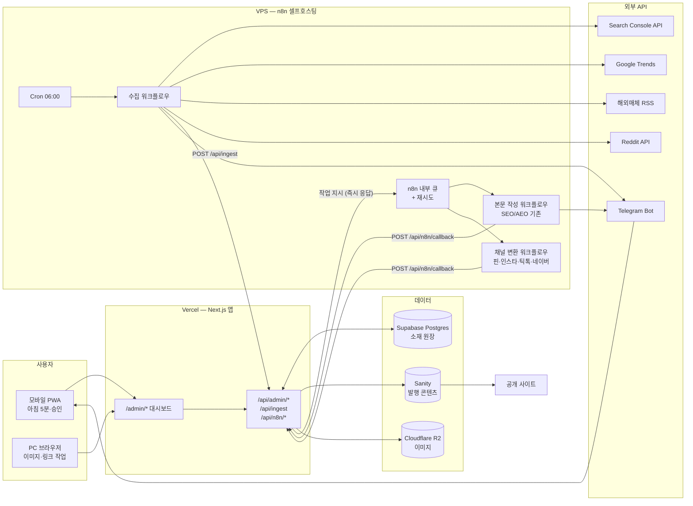

# Muse of Seoul 운영 대시보드 — 시스템 설계 & 착수 사양서

- **작성일**: 2026-08-21
- **선행 문서**: `docs/03-dashboard-problem-definition.md` (문제 정의)
- **이 문서의 목적**: 이 문서만 보고 **바로 구현을 시작**할 수 있게 한다
- **범위 제약**: 운영자 대시보드(`/admin/*`)와 API만. 공개 홈페이지는 수정하지 않는다

---

## 1. 시스템 구조 설계

### 1.1 전체 구조도



### 1.2 컴포넌트별 책임 (경계가 흐려지면 여기로 돌아온다)

| 컴포넌트 | 책임 | 책임이 **아닌** 것 |
|---|---|---|
| **Next.js /admin** | 화면, 사람의 판단 입력, 상태 전이 | LLM 호출, 긴 작업 실행 |
| **Next.js /api** | 원장 읽기·쓰기, n8n 지시, 콜백 수신, Sanity 발행 | 재시도·큐 관리 |
| **Supabase Postgres** | **소재 원장 = 유일한 진실**. 상태·점수·타임스탬프·링크 대장 | 발행된 본문 보관 |
| **Sanity** | **발행된 콘텐츠**만. `post` 문서 | 발행 전 소재·초안 |
| **n8n (VPS)** | 수집 실행, LLM 호출, 채널 변환, **큐·재시도**, 텔레그램 발송 | 상태 소유 (항상 앱에 되돌려줌) |
| **R2** | 이미지 원본·압축본 | — |

> **원칙 재확인 (D2)**: n8n은 상태를 갖지 않는다. n8n이 통째로 죽어도 Postgres의 원장은 온전하고, 워크플로우만 다시 붙이면 복구된다.

### 1.3 왜 Vercel인데 Redis/Worker가 없는가

보여주신 참고 구조에는 Redis Queue + Background Worker가 있지만, 이 프로젝트에서는 **불필요**하다.

- Vercel은 서버리스라 상주 워커를 둘 수 없다 → 앱 안에 큐를 두면 별도 호스팅이 추가로 필요해진다
- 그런데 **n8n이 이미 큐·재시도·실행이력을 내장**하고 있고, VPS에 상주 프로세스로 떠 있다
- 따라서 큐 역할은 n8n에 위임하고, 앱은 **"시작해줘" 호출 후 즉시 응답 → 결과는 웹훅으로 수신**하는 비동기 패턴만 구현한다

```
[앱] --POST dispatch--> [n8n 큐]  (앱은 202 반환하고 끝)
                           |
                        (수 분~수십 분, 재시도 포함)
                           |
[앱] <--POST callback-- [n8n 완료]
```

앱에는 `jobs` 테이블만 두어 "지금 무엇이 돌고 있고 무엇이 실패했는지"를 추적한다.

### 1.4 데이터 저장소 결정 — Supabase Postgres (추천 확정)

문제정의 초안에서는 "Sanity 밖"이라고만 했고 이번에 확정한다.

**선택: Supabase Postgres** (대안: Neon)

| 근거 | 설명 |
|---|---|
| KPI가 집계 중심 | 리드타임 **중앙값**, 단계별 **재고 카운트**, 확산율 — SQL 한 줄 vs GROQ로 전체 fetch 후 JS 집계 |
| 폐기율이 높다 | 선별통과율 25% 가정 → 수집분의 **75%가 버려짐**. 이 쓰레기가 Sanity 데이터셋에 쌓이면 Studio 사용성이 망가짐 |
| 책임 분리와 일관 | Sanity = 발행물 저장소, Postgres = 운영 원장. D2 원칙과 같은 결 |
| 볼륨 | 주 40건 = 연 2,080건. Postgres에선 무의미한 양, Sanity 무료 문서 한도(1만)엔 부담 |
| 1인 운영 적합 | Supabase **Table Editor**로 SQL 없이 데이터를 눈으로 보고 고칠 수 있음 |
| Vercel 궁합 | 공식 통합, 무료 티어로 충분 |

**Sanity를 쓰지 않기로 한 것의 트레이드오프**: 저장소가 하나 늘고 환경변수·마이그레이션 관리가 생긴다. 그 대가로 CMS 오염과 집계 고통을 피한다.

---

## 2. 데이터 모델

### 2.1 상태 머신 (소재 1건의 일생)

```
                    ┌─────────── rejected (버림) ←──────┐
                    │                                    │
collected ──자동스코어링──> screened ──[사람: 채택]──> selected
(수집됨)              (선별 대기 = 재고 K3)              │
                                                         │ (앱 → n8n dispatch)
                                                         ▼
                                                     drafting
                                                    (n8n 작업 중)
                                                         │ (n8n → callback)
                                                         ▼
                                                      review ──[사람: 반려]──┐
                                                   (초안 도착)               │
                                                         │ [사람: 승인]      │
                                                         ▼                   │
                                                     published ←─────────────┘
                                                   (Sanity 발행)
```

전이 규칙:

| From | To | 트리거 | 실행 주체 |
|---|---|---|---|
| collected | screened | 스코어 합계 ≥ 임계값 | 자동 |
| collected/screened | rejected | 버림 버튼 | 사람 (모바일 ✅) |
| screened | selected | 채택 버튼 | 사람 (모바일 ✅) |
| selected | drafting | n8n dispatch 성공 | 자동 |
| drafting | review | n8n callback 수신 | 자동 |
| review | published | 승인 버튼 → Sanity 발행 | 사람 (모바일 ✅) |
| review | selected | 반려 버튼 (재생성) | 사람 (모바일 ✅) |

### 2.2 스키마 (그대로 실행 가능)

```sql
-- 소재 원장
create table ideas (
  id              uuid primary key default gen_random_uuid(),
  title           text not null,
  summary         text,
  source          text not null check (source in ('gsc','trends','rss','reddit','manual')),
  source_url      text,
  source_meta     jsonb default '{}'::jsonb,   -- 검색량·upvote 등 원자료
  category        text check (category in ('beauty','k-beauty','stay','where-to-go')),

  status          text not null default 'collected'
                  check (status in ('collected','screened','selected','drafting','review','published','rejected')),

  -- 선별 3기준 (0~5). competition은 낮을수록 좋아서 역산해 저장
  score_revenue     smallint,
  score_competition smallint,
  score_trend       smallint,
  score_total       smallint generated always as
                    (coalesce(score_revenue,0) + coalesce(score_competition,0) + coalesce(score_trend,0)) stored,

  sanity_post_id  text,           -- 발행 후 연결
  reject_reason   text,

  collected_at    timestamptz not null default now(),
  selected_at     timestamptz,
  published_at    timestamptz,    -- K2 리드타임 = published_at - collected_at
  updated_at      timestamptz not null default now()
);
create index on ideas (status, score_total desc);
create index on ideas (collected_at desc);
create unique index on ideas (source_url) where source_url is not null;  -- 중복 수집 방지

-- 채널별 산출물 (소재 1건 = 최대 5행)
create table channel_outputs (
  id          uuid primary key default gen_random_uuid(),
  idea_id     uuid not null references ideas(id) on delete cascade,
  channel     text not null check (channel in ('web','pinterest','instagram','tiktok','naver')),
  body        text,
  status      text not null default 'pending'
              check (status in ('pending','generated','approved','posted','skipped')),
  posted_at   timestamptz,
  updated_at  timestamptz not null default now(),
  unique (idea_id, channel)
);

-- 제휴 링크 대장 (B4 해소)
create table affiliate_links (
  id             uuid primary key default gen_random_uuid(),
  idea_id        uuid references ideas(id) on delete set null,
  sanity_post_id text,
  program        text not null,   -- 'amazon' | 'coupang' | 'stylekorean' | ...
  product_name   text,
  url            text not null,
  added_at       timestamptz not null default now()
);
create index on affiliate_links (sanity_post_id);

-- n8n 작업 추적 (큐는 n8n이, 가시성은 앱이)
create table jobs (
  id                uuid primary key default gen_random_uuid(),
  idea_id           uuid references ideas(id) on delete cascade,
  kind              text not null check (kind in ('write_body','convert_channels')),
  status            text not null default 'queued'
                    check (status in ('queued','running','done','failed')),
  n8n_execution_id  text,
  error             text,
  requested_at      timestamptz not null default now(),
  finished_at       timestamptz
);
create index on jobs (status, requested_at desc);
```

### 2.3 KPI를 그대로 뽑는 쿼리

```sql
-- K1 주간 발행 달성률
select count(*)::float / 5 as achievement
from ideas
where status='published' and published_at >= date_trunc('week', now());

-- K2 리드타임 중앙값 (일)
select percentile_cont(0.5) within group (
  order by extract(epoch from (published_at - collected_at))/86400
) as median_days
from ideas where status='published';

-- K3 파이프라인 재고 (선행지표)
select status, count(*) from ideas
where status in ('collected','screened','selected','drafting','review')
group by status;

-- K4 채널 확산율
select avg(c.posted_cnt)/5.0 from (
  select idea_id, count(*) filter (where status='posted') as posted_cnt
  from channel_outputs group by idea_id
) c;

-- K5 수익 연결률 + 링크 0개 발행글 (경고 대상)
select i.id, i.title, count(a.id) as link_cnt
from ideas i left join affiliate_links a on a.idea_id = i.id
where i.status='published'
group by i.id, i.title
having count(a.id) = 0;
```

---

## 3. API 규약

인증은 전부 **공유 시크릿 헤더**(`X-Api-Key`)로 한다. 사용자는 1명이고 호출자는 n8n뿐이라 OAuth는 과잉이다.

### 3.1 n8n → 앱 : 수집 결과 적재

```
POST /api/ingest
X-Api-Key: <N8N_INGEST_SECRET>

{ "items": [
  { "title": "...", "source": "reddit", "source_url": "https://...",
    "source_meta": { "upvotes": 1240, "subreddit": "AsianBeauty" } }
]}

→ 200 { "inserted": 6, "skipped_duplicate": 2 }
```
`source_url` unique 인덱스로 중복은 조용히 skip.

### 3.2 앱 → n8n : 작업 지시 (즉시 반환)

```
POST {N8N_BASE_URL}/webhook/write-body
X-Api-Key: <N8N_SHARED_SECRET>

{ "job_id": "...", "idea_id": "...", "title": "...", "category": "k-beauty",
  "source_url": "...", "source_meta": {...},
  "callback_url": "https://<앱>/api/n8n/callback" }

→ 202 { "n8n_execution_id": "..." }   // 앱은 jobs.status='running' 기록 후 종료
```

채널 변환도 동일 형태로 `/webhook/convert-channels` 호출(`channels: ["pinterest","instagram","tiktok","naver"]`).

### 3.3 n8n → 앱 : 결과 콜백

```
POST /api/n8n/callback
X-Api-Key: <N8N_CALLBACK_SECRET>

{ "job_id": "...", "idea_id": "...", "kind": "write_body",
  "status": "done",
  "payload": { "web": { "title": "...", "body_md": "...", "seo": {...} } } }
```
앱 처리: `jobs` 갱신 → `channel_outputs` upsert → `ideas.status = 'review'` → 텔레그램 알림 트리거.
`status: "failed"`면 `jobs.error` 기록 + 알림. **n8n이 재시도를 다 소진한 뒤에만 failed를 보낸다.**

### 3.4 앱 내부 (화면용)

| 메서드 | 경로 | 용도 |
|---|---|---|
| POST | `/api/admin/ideas/[id]/select` | 채택 → dispatch |
| POST | `/api/admin/ideas/[id]/reject` | 버림 |
| POST | `/api/admin/ideas/[id]/approve` | 승인 → Sanity 발행 → published |
| PATCH | `/api/admin/outputs/[id]` | 초안 텍스트 수정 (모바일) |
| POST | `/api/admin/links` | 제휴 링크 등록 |
| GET | `/api/admin/kpi` | K1·K2·K3 |

---

## 4. n8n 워크플로우 (3개)

| # | 이름 | 트리거 | 하는 일 |
|---|---|---|---|
| **W1** | `collect-daily` | Cron 06:00 KST | GSC API → Trends → RSS ×N → Reddit API 순회 → 정규화 → `POST /api/ingest` → 텔레그램 요약 |
| **W2** | `write-body` | Webhook | (**기존 워크플로우 재사용**) 본문+SEO/AEO 생성 → `POST /api/n8n/callback` → 텔레그램 "초안 도착" |
| **W3** | `convert-channels` | Webhook | 승인된 웹 본문을 입력으로 핀/인스타/틱톡/네이버 4갈래 병렬 변환 → callback |

재시도 정책: 각 HTTP 노드 3회 재시도(지수 백오프). 3회 실패 시에만 `status:"failed"` 콜백.

---

## 5. 환경변수 추가 목록

**Vercel (앱)**
```
DATABASE_URL              # Supabase Postgres 연결 문자열
N8N_BASE_URL              # https://n8n.<도메인>
N8N_SHARED_SECRET         # 앱 → n8n 호출 시
N8N_INGEST_SECRET         # n8n → /api/ingest
N8N_CALLBACK_SECRET       # n8n → /api/n8n/callback
```

**VPS (n8n)**
```
GSC_SERVICE_ACCOUNT_JSON  # Search Console API
REDDIT_CLIENT_ID / REDDIT_CLIENT_SECRET
TELEGRAM_BOT_TOKEN / TELEGRAM_CHAT_ID
APP_BASE_URL / N8N_INGEST_SECRET / N8N_CALLBACK_SECRET
```

> ⚠️ n8n이 셀프호스팅 VPS이므로 **HTTPS와 방화벽**을 먼저 잡아야 한다. Vercel에서 호출 가능한 공인 도메인 + 인증서가 전제조건이다.

---

## 6. 화면 구조 (모바일 우선)

| 라우트 | 화면 | 기기 | 핵심 동작 |
|---|---|---|---|
| `/admin` | 홈 — KPI 바 + 오늘 할 일 | 폰 | K1·K2·K3, 다음 액션 3개 |
| `/admin/inbox` | 수집함 / 선별 | **폰** | 카드 스와이프: 채택 / 버림 |
| `/admin/pipeline` | 파이프라인 칸반 | PC·폰 | 상태별 재고 확인 |
| `/admin/idea/[id]` | 초안 상세 | **폰** | 읽기 + 간단 수정 + 승인/반려 |
| `/admin/idea/[id]/channels` | 채널 체크리스트 | 폰 | 5칸 체크, 산출물 복사 |
| `/admin/links` | 제휴 링크 대장 | PC | 표 + 링크 0개 글 경고 |
| `/admin/write`, `/admin/images` | 기존 유지 | PC | 손대지 않음 |

`/admin` 아래이므로 기존 `middleware.ts` 쿠키 인증과 admin PWA 매니페스트가 그대로 적용된다 (D6).

---

## 7. 착수 순서 — 각 단계는 "동작하는 것"으로 끝난다

| Step | 작업 | 완료 기준 (이게 되면 다음으로) |
|---|---|---|
| **S1** | Supabase 프로젝트 생성 + 2.2 스키마 실행 + `DATABASE_URL` 연결 | 앱에서 `ideas` 1건 insert/select 성공 |
| **S2** | `POST /api/ingest` + W1 수집 워크플로우 (**RSS만 먼저**) | 다음 날 06:00에 RSS 소재가 `ideas`에 자동으로 쌓임 |
| **S3** | `/admin/inbox` 선별 화면 (모바일 카드) | **폰에서** 채택/버림이 되고 status가 바뀜 |
| **S4** | dispatch + callback 배선, W2에 기존 본문 워크플로우 연결 | 채택하면 몇 분 뒤 `review` 상태로 초안 도착 |
| **S5** | `/admin/idea/[id]` 승인 화면 + Sanity 발행 연결 | **폰에서** 승인하면 공개 사이트에 글이 뜸 |
| **S6** | W3 채널 변환 4종 + 체크리스트 화면 | 소재 1건에 5채널 산출물이 생김 |
| **S7** | 링크 대장 + KPI 바 + 텔레그램 알림 | 아침에 텔레그램 요약이 오고 링크 0개 글이 표시됨 |

**S2에서 수집 소스를 RSS 하나로 좁힌 이유**: GSC 서비스계정·Reddit OAuth는 인증 셋업에 시간이 걸린다. RSS는 인증이 없어 **파이프라인 전체를 가장 빨리 관통**시킬 수 있다. 관통이 확인된 뒤 소스를 늘린다.

---

## 8. 이 문서에서 확정한 것 (03번 문서 결정표에 추가)

| # | 결정 | 근거 |
|---|---|---|
| D10 | 앱 호스팅 = **Vercel** | 사용자 확정 |
| D11 | n8n = **VPS 셀프호스팅**, 공인 HTTPS 도메인 필요 | 사용자 확정 |
| D12 | 큐·재시도는 **n8n이 책임**, 앱에 Redis/Worker 없음 | Vercel 서버리스 + n8n 내장 큐 |
| D13 | 소재 원장 = **Supabase Postgres** (Sanity 아님) | 집계 편의 + CMS 오염 방지 (1.4) |
| D14 | 인증은 **공유 시크릿 헤더** | 사용자 1명, 호출자 n8n뿐 |
| D15 | S2 수집 소스는 **RSS부터** | 인증 없이 파이프라인 최단 관통 |

---

## 9. 여전히 미해결 (구현 중 결정)

1. 레딧 서브레딧 목록 · 해외 매체 RSS 최종 목록
2. 선별 스코어링 가중치와 `screened` 승격 임계값
3. 핀터레스트·인스타용 **이미지** 생성/선택 플로우 — 텍스트만으론 채널 발행 불가
4. 수집 퍼널 실측 보정 (4주 후)
5. GA4 Data API 연동 (2차) · 수익 API 연동 순서 (2차)
